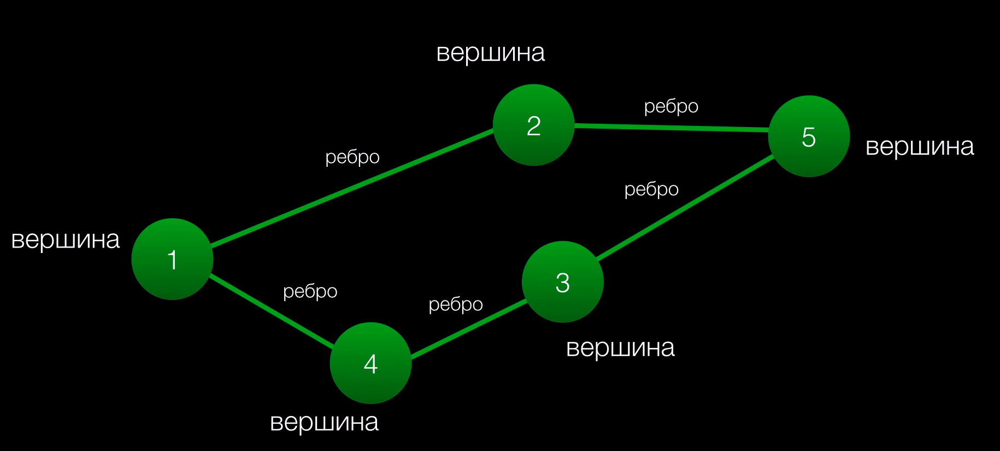
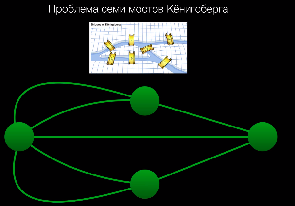

# Графы

> Граф — математическая абстракция реальной системы любой природы, объекты которой обладают парными связями. Граф как математический объект есть совокупность двух множеств — множества самих объектов, называемого множеством вершин, и множества их парных связей, называемого множеством рёбер. Элемент множества рёбер есть пара элементов множества вершин.

### Проблема 7-и мостов Кёнисберга

Свойства графов:
1. Число нечётных вершин (вершин, к которым ведет нечётное число рёбер) графа должно быть чётное. Не может сущестововать граф, который имел бы нечётное число нечётных вершин.
2. Если все вершины графа чётные, то можно, не отрываясь, начертить граф, начиная с любой вершины графа и завершая в этой же вершине
3. Граф с более чем двумя нечётными вершинами невозможно начертить одним росчерком