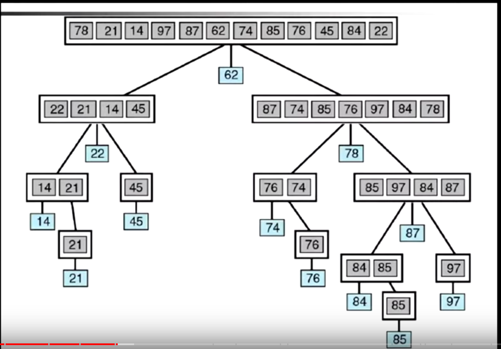

# Быстрая сортировка
Работает за O(log2n * n)

Быстрая сортировка относится к алгоритмам «разделяй и властвуй».

### Алгоритм состоит из трёх шагов:

1. Выбрать элемент из массива. Назовём его опорным.
2. Разбиение: перераспределение элементов в массиве таким образом, что элементы, меньшие опорного, помещаются перед ним, а большие или равные - после.
3. Рекурсивно применить первые два шага к двум подмассивам слева и справа от опорного элемента. Рекурсия не применяется к массиву, в котором только один элемент или отсутствуют элементы.
### Визуализация


```javascript
const arr = Array(100000).fill(null).map(item => Math.floor(Math.random() * 2000 - 1000));

// time complexity O(n**2)
const quickSort = (arr) => {
    if(arr.length < 1){
			return arr
    }
		let pivotIndex = Math.floor(arr.length / 2);
		let pivot = arr[pivotIndex];
		let lessThanPivot = [];
	  let moreThanPivot = [];
		
		for(let i = 0; i < arr.length; i++){
			if(pivotIndex === i) continue;
			
			if(i < pivotIndex) lessThanPivot.push(i)
      else moreThanPivot.push(i)
    }
		
    return [...quickSort(lessThanPivot), pivot, ...quickSort(moreThanPivot)]
}

quickSort(arr);
```