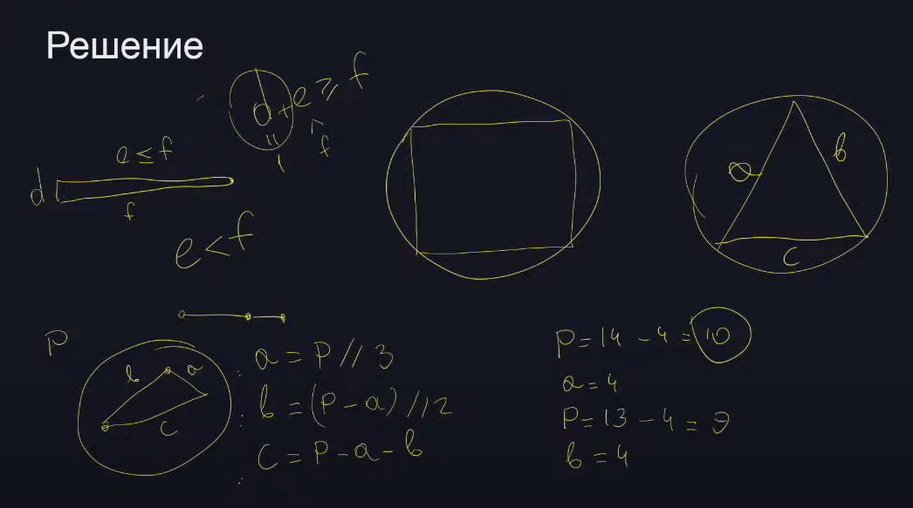

# Наибольшая/наименьшая плошадь треугольника при заданном периметре

Среди треугольников периметра P с целыми длинами сторон найдите
трецугольник наибольшей и наименьшей ненулевой площади
Входные данные 3 <= P <= 10**9



```javascript
const calculateArea = (p) => {
	// Находим наибольшую
	const a = Math.floor(p / 3);
	const b = Math.floor((p - a)  / 2);
	const c = p - a - b;
	const res = []

	if(a + b <= c){

		return -1
	} else {
		res.push({a,b,c})
		
		// Находим наименьшую площадь
		const d = p % 2 === 0 ? 2 : 1;

		const e = (p - d)
    const f = p - d - e
		res.push({a: d,b: e,c: f})
	}
  
	return res
}
```